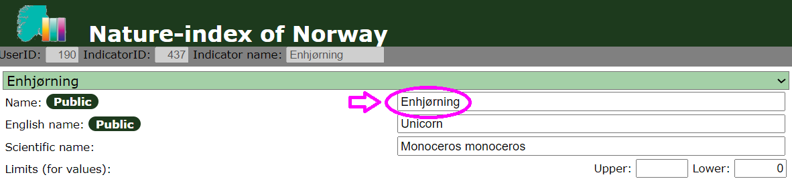

```{r setup, include=FALSE}
knitr::opts_chunk$set(echo = TRUE)
```

## About this tutorial

This short tutorial is intended for people that want to upload new and/or updated indicator data to the Nature index database (<https://naturindeks.nina.no/>) using R. Data can also be uploaded to the database manually, but for code-based workflows it is worthwhile to incorporate the data upload into the scripting, especially if there are many values that need to be entered and/or updated.

The tutorial assumes that you already have the new/updated data available in some format. It does not provide code for restructuring your data to meet the formatting requirements for upload either, as that code will be different for every case.

What it does provide are step-wise instructions on how to write the data upload part of your workflow, as well as a few helper functions that may facilitate this task for you.

## Before you begin: access and dependencies

Before you get started, you should double-check that you have working login credentials for the Nature index database. You can do this by logging into the database online: <https://naturindeks.nina.no/> If you do not have login credentials yet or have trouble logging in, you can contact the Nature index coordination team by sending an email to [naturindeks\@nina.no](mailto:naturindeks@nina.no){.email}.

The second thing you need to do is install the R pacakge "NIcalc" (<https://github.com/NINAnor/NIcalc>) and its dependencies. NIcalc was developed to handle tasks and calculations related to the Nature index for Norway; among other things, it contains functions for accessing the Nature index database directly from R. The package is not available on CRAN, and you therefore need to install it directly from GitHub, e.g. using the "devtools" package:

```{r}
if(!("NIcalc" %in% installed.packages())){
  devtools::install_github("NINAnor/NIcalc", build_vignettes = T)
}
```

In addition to "NIcalc", we are going to need the packages "dplyr" and "magrittr" installed. The latter also needs to be loaded into the environment for the helper functions to work as they should:

```{r}
library(magrittr)
```

Finally, we are going to source all the helper functions that are provided in the "R" folder so that they are readily available to us:

```{r}
sourceDir <- function(path, trace = TRUE, ...) {
  for (nm in list.files(path, pattern = "[.][RrSsQq]$")) {
    if(trace) cat(nm,":")
    source(file.path(path, nm), ...)
    if(trace) cat("\n")
  }
}
sourceDir('R')
```

If you want to know more about the specific functions, you can check out the respective code files in the "R" folder and consult each functions's roxygen documentation.

## Step 1: Download and check format of existing data

We get started by downloading the existing data for our indicator from the Nature index database. Irrespective of whether we intend to just add a few new data entries or update the entire data set for our indicator of interest, the existing data will be our starting point (not least because the data we are going to upload has to have the exactly same format as the data we get when we download).

The function `downloadData_NIdb()` retrieves existing data for us. The main argument of the function is `indicators`, which is a list of the Norwegian names of the relevant indicators. If you are unsure about the spelling of the names of your indicators, you can check it in the top left corner of the "Indicator" page in the database: 

Our example indicator for this tutorial is the unicorn, entered in the Nature index database under its Norwegian name "Enhjørning". We work with this single-indicator example from here on, but you can also pass a vector of indicator names to the helper functions to do the operations for several indicators at once.

To retrieve existing data, we call `downloadData_NIdb()`:

```{r}
oldIndicatorData <- downloadData_NIdb(indicators = "Enhjørning")
```

Once the function is called, a box will pop up asking you to enter first your registered email address and then your Nature index database password. If the credentials are added correctly, data will be downloaded. *Note*: We are aware that the interactive credential promps are not a good solution for (semi-) automated workflows. If you would like to bypass manually entering credentials, we recommend saving your login credentials as environmental variables and adapting `downloadData_NIdb()` to retrieve credentials form the environment instead of asking for them.

Let's have a look at the structure of `oldIndicatorData`:

```{r}
str(oldIndicatorData)
```

It comes as a list that contains 1) a data frame called `indicatorValues` and a list called `customDistributions`. The `indicatorValues` table is relevant for everyone, while the `customDistributions` list will be irrelevant and empty for many indicators. For indicators that are reported with user-specified custom distributions for quantifying uncertainty in indicator data values, the `customDistributions` list will contain unique information characterizing each specified distribution.

For now, we will focus on the `indicatorValues` table. The table has a row for each year in the period 1960-2024, as well as for the year 1950 and for the reference value ("Referanseverdi"). Most of the rows do not contain any data because traditionally, only data for the years directly linked to the periodic Nature index updates were added, i.e. 1990, 2000, 2010-2014, and 2019. The primary goal for the 2025 update is to add indicator data corresponding to the year 2024, but it is possible - and encouraged - to add data for "in-between" years as well if they are readily available. For looking more into the structure of `indicatorValues`, we'll focus first on the subset of years that have data available in the database at present:

```{r}
oldIndicatorData[[1]]$indicatorValues %>%
  dplyr::filter(!is.na(verdi))
```

First, we have the indicators ID (`indicatorId`) and name (`indicatorName`), followed by the IDs and names of all areas for which the indicator has data (`areaId` and `areaName`). Next are the ID and name/definition for each year in the data. The reference value is coded as `yearName = Referanseverdi`. The `yearID` is a dummy variable that was previously used for linking the correct years when uploading data from via NIcalc, but it is no longer in use - you do not need to worry about it (for new entries, you can leave it as `NA`). The next three columns hold the actual indicator data: `verdi` is the average indicator value, and `nedre_Kvartil` and `ovre_Kvartil` are the 25% and 75% quartiles of the uncertainty distribution for the indicator value. If your indicator's uncertainty has previously been quantified using a custom distribution (often the case for modelled indicators), `nedre_Kvartil` and `ovre_Kvartil` will be `NA`, and there will instead be an identifier in the column `customDistributionUUID`. Each distribution identifier will have a match in `oldIndicatorData$customDistributions`, where additional information on the distribution (type and parameter values) are stored. After the values, we have a few columns that hold additional information on the data; `datatypeName` and `datatypeId` categorize indicator data into one of:

-   `Ekspertvurdering` with ID 1
-   `Overvåkingsdata` with ID 2
-   `Beregnet fra modeller` with ID 3

Not all data points necessarily have to arise from the same data type; quite often, the reference value is an expert judgement while the yearly indicator data may be monitoring data or modelled estimates. Sometimes, yearly indicator data are also a mixture of approaches. What should be the same for all data points, including the reference value, is `unitOfMeasurement`.

The remaining columns in the data download (`distributionName`, `distributionId`, `distParam1`, `distParam2`) are not relevant in most cases and not described in more detail here.

## Step 2: Prepare and format new/updated data

In the next step, we need to i) format our new and/or updated indicator data to match the format of the downloaded data and ii) combine it with the previous data to prepare a complete new data upload. Since the download already contains one row for each area-year combination, there is not really a difference between changing/updating an existing value and adding a new value (i.e. a value for an area-year combination for which there was `NA` before). In the following, we'll demonstrate how to prepare and format new indicator values with uncertainty defined through quantiles and with uncertainty defined through custom distributions.

Note: Please keep in mind that what we present below is a very simple example and it uses neither the most elegant nor the most efficient coding approach. The coding for data preparation and formatting for your specific indicator will look different and depend on a range of factors such as how many species-area-year combinations you are adding/editing data for, what format and structure your indicator data has prior to formatting, etc. The bottom-line is that as long as your formatted updated indicator data has the same format as the data downloaded from the Nature Index database, it does not matter how you get there code-wise.

### Indicator data uncertainty via quartiles

For the sake of the example, let's assume that we have assessed the population status of unicorns for 2024 differently in southern and northern Norway. In the South, we have used the same method as previously, i.e. expert judgement. Our experts have come to the conclusion that the following values are representative:

```{r}
unicornSN2024_mean <- 0.2 # Average
unicornSN2024_lQ <- 0.12 # Lower quartile
unicornSN2024_uQ <- 0.24 # Upper quartile
```

To make the updated indicator data for southern Norway, we start from the `indicatorValues`table from the downloaded data, and then add in our new information:

```{r}
# Make a copy of existing indicator data
updatedIndicatorData <- oldIndicatorData

# Extract indicatorValues table (for the relevant indicator) for editing
updatedIndVals <- updatedIndicatorData[[1]]$indicatorValues

# Identify index for area-year combination we want to edit
idx <- which(updatedIndVals$yearName == 2024 & updatedIndVals$areaName == "Sør-Norge")

# Add new indicator data
updatedIndVals$verdi[idx] <- unicornSN2024_mean
updatedIndVals$nedre_Kvartil[idx] <- unicornSN2024_lQ
updatedIndVals$ovre_Kvartil[idx] <- unicornSN2024_uQ

# Check new entry
subset(updatedIndVals, yearName == 2024 & areaName == "Sør-Norge")
```

This looks good, but we are still missing some of the metadata. Specifically, the rows `datatypeID` and `datatypeName` are NA, and these need to be filled in. Since we have determined the new 2024 value using the same method as previously, we set the ID and name for expert judgement:

```{r}
# Add metadata
updatedIndVals$datatypeId[idx] <- 1
updatedIndVals$datatypeName[idx] <- "Ekspertvurdering"

# Check new dataset for southern Norway (subset with values)
updatedIndVals %>%
  dplyr::filter(!is.na(verdi))
```

Now we have a complete new entry for "Sør-Norge" for the year 2024. Before proceeding, we have to insert the new table back into the downloaded data structure:

```{r}
updatedIndicatorData[[1]]$indicatorValues <- updatedIndVals
```

You are perhaps wondering whether there isn't a more efficient way to do this. There are for sure several more efficient approaches for any particular (set of) indicators, but one approach that may be useful for a range of cases is the helper function `NIcalc::setIndicatorValues`. It is a wrapper for updating indicator data for specific area-year combinations, and we'll demonstrate its use below for adding a 2023 value for unicorns in southern Norway:

```{r}
unicornSN2023_mean <- 0.16 # Average
unicornSN2023_lQ <- 0.10 # Lower quartile
unicornSN2023_uQ <- 0.20 # Upper quartile

# Extract relevant area ID (needed for mapping)
SN_areaID <- updatedIndicatorData[[1]]$indicatorValues$areaId[dplyr::first(which(updatedIndicatorData[[1]]$indicatorValues$areaName == "Sør-Norge"))]

updatedIndicatorData[[1]] <- NIcalc::setIndicatorValues(updatedIndicatorData[[1]], 
                                                        areaId = SN_areaID, 
                                                        years = 2023, 
                                                        est = unicornSN2023_mean,
                                                        lower = unicornSN2023_lQ,
                                                        upper = unicornSN2023_uQ,
                                                        datatype = 1,
                                                        unitOfMeasurement = "individer/km^2")

# Check available data
updatedIndicatorData[[1]]$indicatorValues %>%
  dplyr::filter(!is.na(verdi))
```

### Indicator data uncertainty via custom distributions

For northern Norway, data on unicorn abundance has been collected over the last three years, and this data has been used to model 2024 abundance across the region. Consequently the "input" we have for the 2024 indicator data for northern Norway is a probability distribution obtained from a model analysis. More specifically, what we have are the parameters characterizing a lognormal distribution:

```{r}
unicornNN2024_meanlog <- -1.7 # Log mean
unicornSN2024_sdlog <- 0.09 # Log standard deviation

hist(rlnorm(1000, meanlog = unicornNN2024_meanlog, sdlog = unicornSN2024_sdlog),
     xlab = "Model estimate", main = "Unicorn abundance (Nord-Norge, 2024)")
```

We want to add the uncertainty in the indicator value via a custom distribution, i.e. instead of calculating quartiles from this distribution, we want to enter the parameters of the distribution itself into the Nature index database. The "NIcalc" package contains functions that allow us to do this.

First, we use `NIcalc::makeDistribution` to make a distribution object based on the parameters we got from our unicorn abundance model:

```{r}
distObj <- NIcalc::makeDistribution(input = "logNormal",
                                    distParams = list(mean = unicornNN2024_meanlog,
                                                      sd = unicornSN2024_sdlog))
```

Then, we use the function `NIcalc::setIndicatorValues` to insert our new indicator estimate specified by the custom distribution into the updated indicator data object:

```{r}
# Extract relevant area ID (needed for mapping)
NN_areaID <- updatedIndicatorData[[1]]$indicatorValues$areaId[dplyr::first(which(updatedIndicatorData[[1]]$indicatorValues$areaName == "Nord-Norge"))]

# Add new indicator value using custom distribution
updatedIndicatorData[[1]] <- NIcalc::setIndicatorValues(updatedIndicatorData[[1]], 
                                                        areaId = NN_areaID, 
                                                        years = 2024, 
                                                        distribution = distObj,
                                                        datatype = 3,
                                                        unitOfMeasurement = "individer/km^2")

# Check available data
updatedIndicatorData[[1]]$indicatorValues %>%
  dplyr::filter(!is.na(verdi))
```

If we take a closer look at the new 2024 entry for area "Nord-Norge", we can see that we have the correct mean under "verdi" (`exp(unicornNN2024_meanlog) =` `r exp(unicornNN2024_meanlog)`). `nedre_Kvartil`and `ovre_Kvartil` remained NA, as they should, but instead there is now an identifier under `customDistributionUUID`. We'll find this identifier in the second object within `updatedIndicatorData`, together with the parameters we used for specifiying the distribution:

```{r}
updatedIndicatorData[[1]]$customDistributions
```

## Step 3: Double-check values and formats

Before proceeding to uploading a new indicator data, it is important to double-check that everything has the correct format and looks as it should. The best way to do that also depends on your input data, the number of values you have updated, etc. and you will be the best judge of what and how to check your work.

Irrespective of your data/values, it is important to check that the object classes and formats of your updated indicator data are correct, i.e. identical to the indicator data you downloaded from the database. Here are some examples for simple checks for that:

```{r}
# Compare object classes & dimensions
class(oldIndicatorData) == class(updatedIndicatorData)
length(oldIndicatorData) == length(updatedIndicatorData)
names(oldIndicatorData) == names(updatedIndicatorData)

for(i in 1:length(updatedIndicatorData)){
  class(oldIndicatorData[[i]]) == class(updatedIndicatorData[[i]])
  length(oldIndicatorData[[i]]) == length(updatedIndicatorData[[i]])
  names(oldIndicatorData[[i]]) == names(updatedIndicatorData[[i]])

  dim(oldIndicatorData[[i]]$indicatorValues) == dim(updatedIndicatorData[[i]]$indicatorValues)
    colnames(oldIndicatorData[[i]]$indicatorValues) == colnames(updatedIndicatorData[[i]]$indicatorValues)
}
```

You may also want to get an overview over what information in the indicator data table has been changed/updated compared to the previous version:

```{r}
## Make a data frame containing information on changed fields
diffData <- oldIndicatorData[[1]]$indicatorValues[, 1:6]
colnames(diffData) <- c("indicatorId_meta", "indicatorName_meta", "areaId_meta", "areaName_meta", "yearId_meta", "yearName_meta")

for(i in 1:ncol(oldIndicatorData[[1]]$indicatorValues)){

  diffData$focal_col <- paste(oldIndicatorData[[1]]$indicatorValues[, i]) == paste(updatedIndicatorData[[1]]$indicatorValues[, i]) 
  diffData <- diffData %>%
    dplyr::mutate(focal_col = ifelse(focal_col, "x", "updated"))
  colnames(diffData)[which(colnames(diffData) == "focal_col")] <- colnames(oldIndicatorData[[1]]$indicatorValues)[i]
}

## Show overview over all changes
diffData$Updated <- "no"
for(i in 1:nrow(diffData)){
  
  if("updated" %in% diffData[i, ]){
    diffData$Updated[i] <- "yes"
  }
}

diffData %>%
  dplyr::filter(Updated == "yes")
```

## Step 4: Upload updated data

Once you have made sure that your updated indicator data is correct and its format consistent with the download from the database, you can prepare for the upload to the Nature index database. The helper function `uploadData_NIdb()` will facilitate the upload for you. It will first prompt you for your login credentials just like the download function, and then open a pop-up window where you need to confirm that you want to write to the database.

**Important note:** If you write to the database, you will overwrite the values that are currently stored there. For that reason, please only upload to the database once you have completed, verified, and quality-checked your updated indicator data.

```{r}
uploadData_NIdb(indicatorData = updatedIndicatorData)
```
